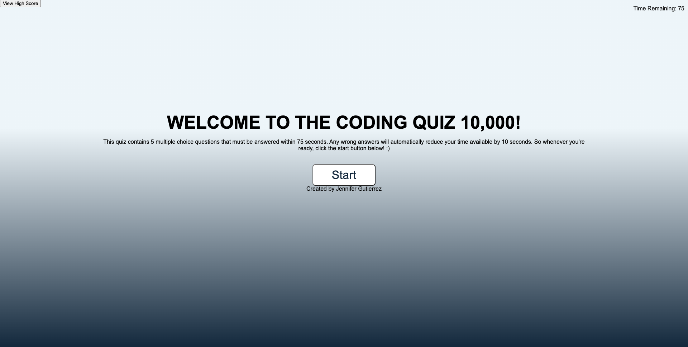
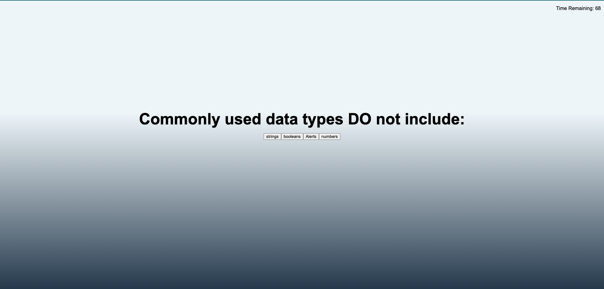
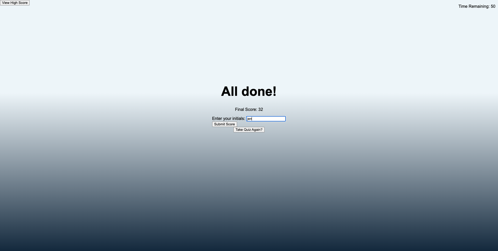

# CODING QUIZ

## Description
This website contains the capacity to display question after question once a selection is made while working with a time constraint to end the quiz. At this point the program offers you the chance to enter in your name and have your high score saved, of which you'll be prompted to view all of the high scores recorded. 
 
 
The goal of this assignment was to select and generate HTML elements using API's (DOM manipulation model, event handling methods, and ajax methods) which were used to change the contents of the page. Another key element of this assignment was to with working with localStorage. 
 
 
You can check out the deployed application from the link below:
 
[https://jenjen0219.github.io/CodingQuiz/](https://jenjen0219.github.io/CodingQuiz/)

## Table of Contents
- [Technologies](#technologies)
- [Installation](#installation)
- [Usage](#usage)
- [License](#license)

## Technologies
No special technologies.

## Installation
No special requirements.

## Usage
- Start page

- Quiz Question page

- Results page

- High Scores Page

## License
Jennifer Gutierrez Manjares  
Github Profile: https://github.com/jenjen0219

